# Section 1: Geometric Foundations, Priority Queue

This section implements a model two-link manipulator consisting of two polygon shapes: a base and an arm. In this model, polygons can be either hollow or solid - a hollow polygon means that the area outside of the vertices is occupied while for a solid polygon the area inside of the vertices is occupied. This section also defines helper functions for determining whether points are in collision with polygons, and whether points are visible from other points, both of which are determined based on if the polygon is hollow or solid. In our implementation, if the polygon vertices are stored in clockwise order, the polygon is hollow; if not, it is solid.

## Contents

- `geometry.py`
  - Defines `Edge` and `Polygon` objects, with helper functions for collision tests, visibility tests, and polygon operations.
- `queue.py`
  - Priority queue implementation
  - Supports priority insertion, minimum extraction, membership testing, printing, and descending-order display.
- `robot.py`
  - Defines the polygons used in the two-link manipulator model
    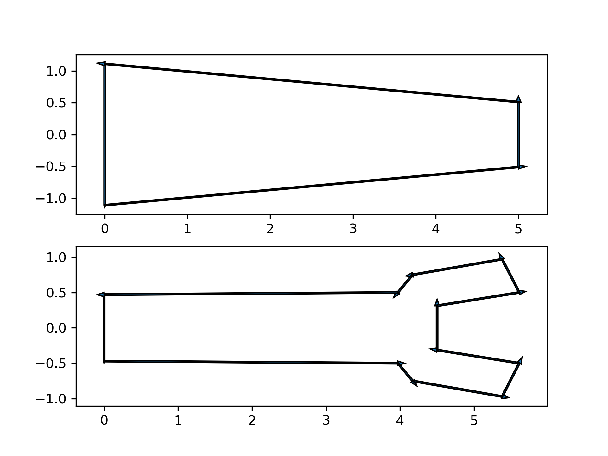

- `pygments.py`
  - Optional syntax highlighting helper script for rendering code.
- `main.py`
  - main Homework 1 implementation and test driver for geometry and queue functionality.
- `main.ipynb`
  - Jupyter notebook for running individual tests.

## `main.py` Function Call Explanations

`main.py` defines several test functions. The script entry point currently calls one of these functions when run.

- `edge_is_collision_test()`
  - Creates two edges: one fixed and one random within the unit square.
  - Checks whether the edges collide.
  - Plots the two edges in green when there is no collision and red when they intersect.
    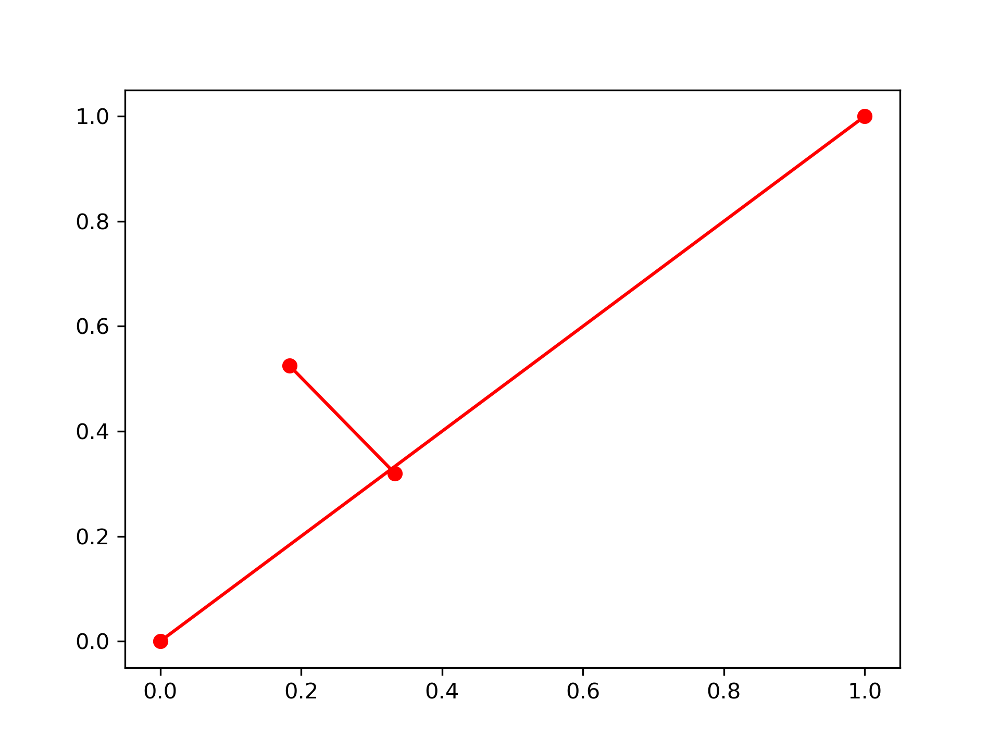
    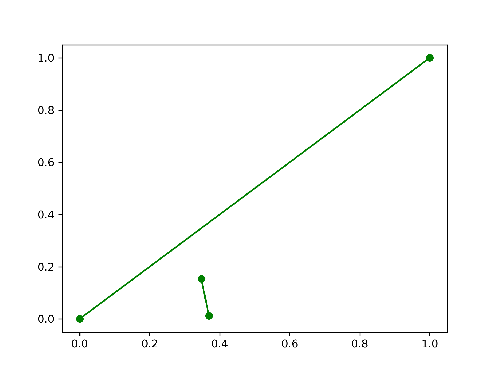

- `polygon_is_self_occluded_test(nb_points=61)`
  - Builds a polygon from three vertices.
  - Tests a set of points around the polygon for self-occlusion with respect to a chosen vertex.
  - Plots the polygon and draws rays in green for visible points and red for occluded points.
    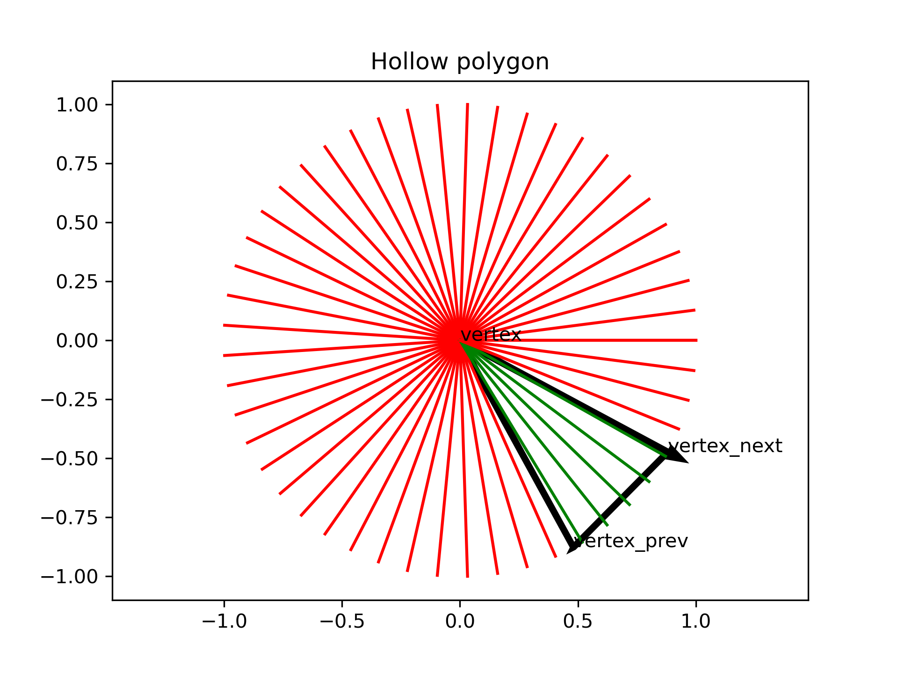
    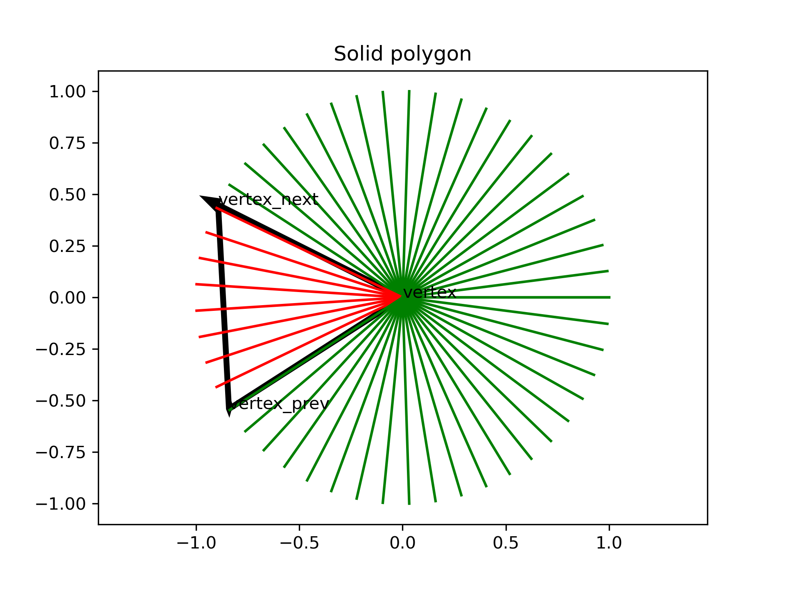

- `polygon_is_visible_test()`
  - Generates random test points in the rectangle `[0,5] x [-2,2]`.
  - Uses two workspace polygons from `robot.polygons`.
  - For each polygon and each vertex, checks visibility to all test points.
  - Plots the polygon and lines from each vertex to test points in green when visible and red when not visible.
  - Reverses polygon vertex order and repeats the same visibility test.
    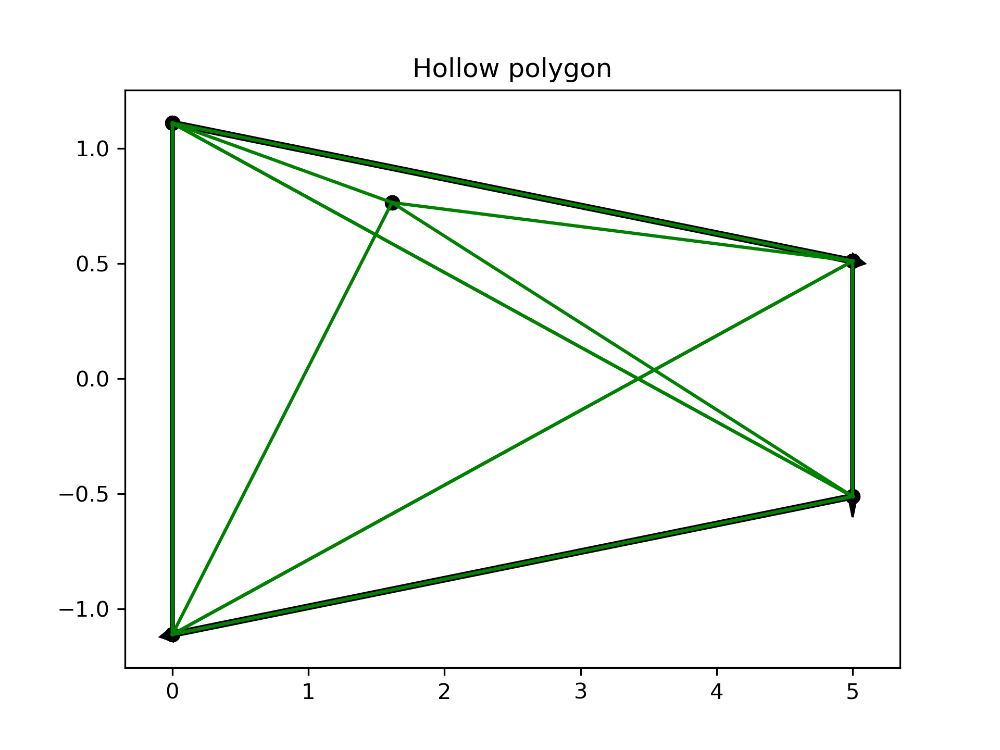
    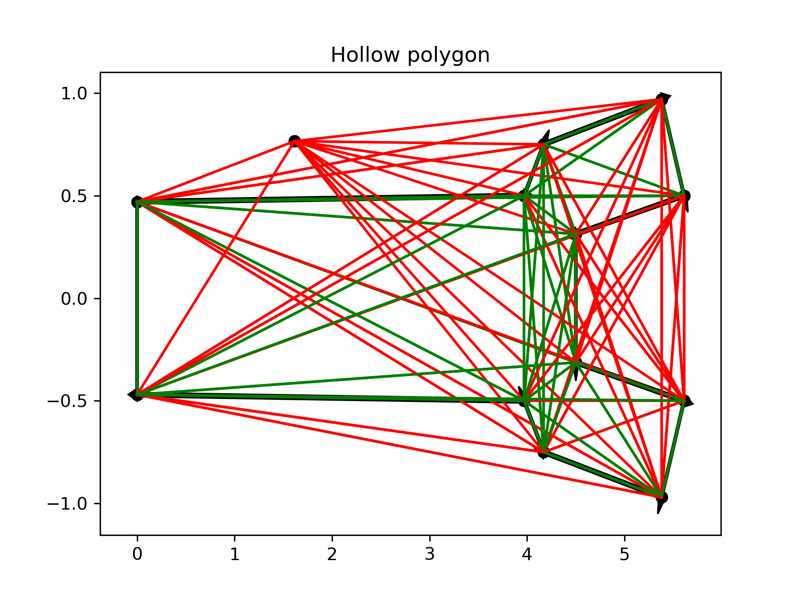
    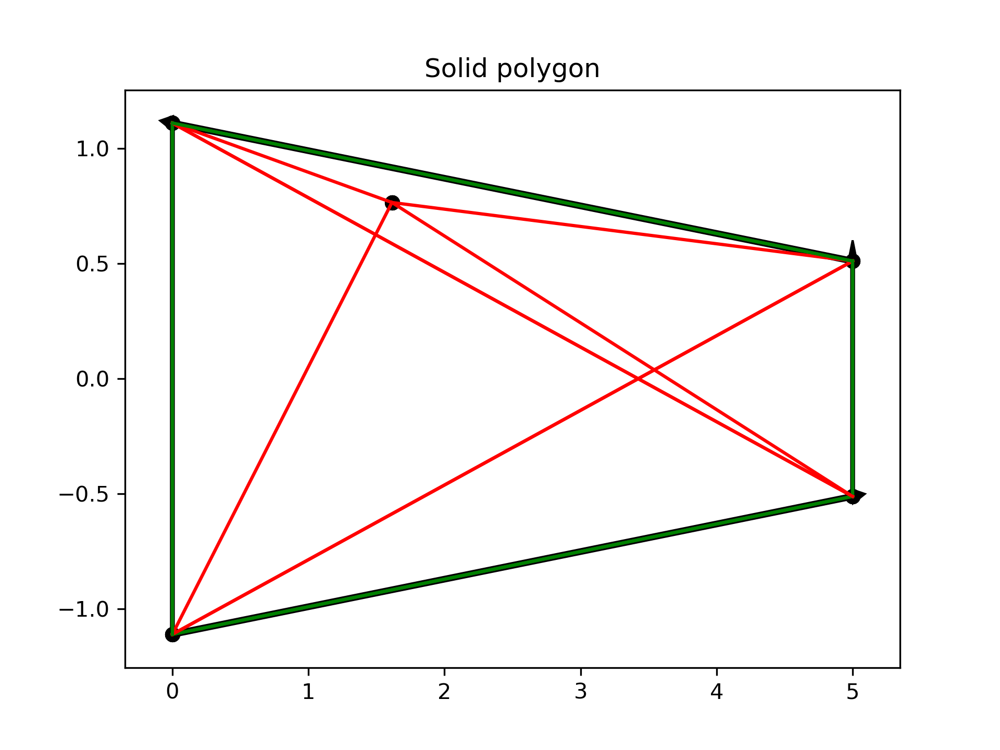
    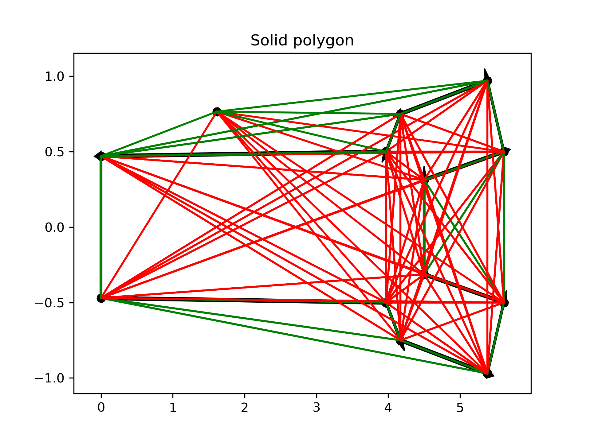

- `polygon_is_collision_test()`
  - Generates 100 random test points in the rectangle `[0,5] x [-2,2]`.
  - For each polygon in `robot.polygons`, checks collision between each point and the polygon.
  - Plots points in green when outside the polygon and red when in collision.
  - Repeats the test after flipping polygon vertex order.
    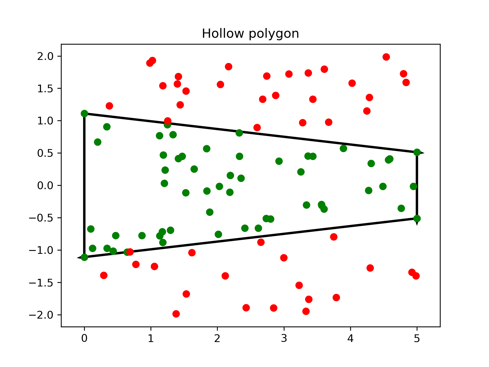
    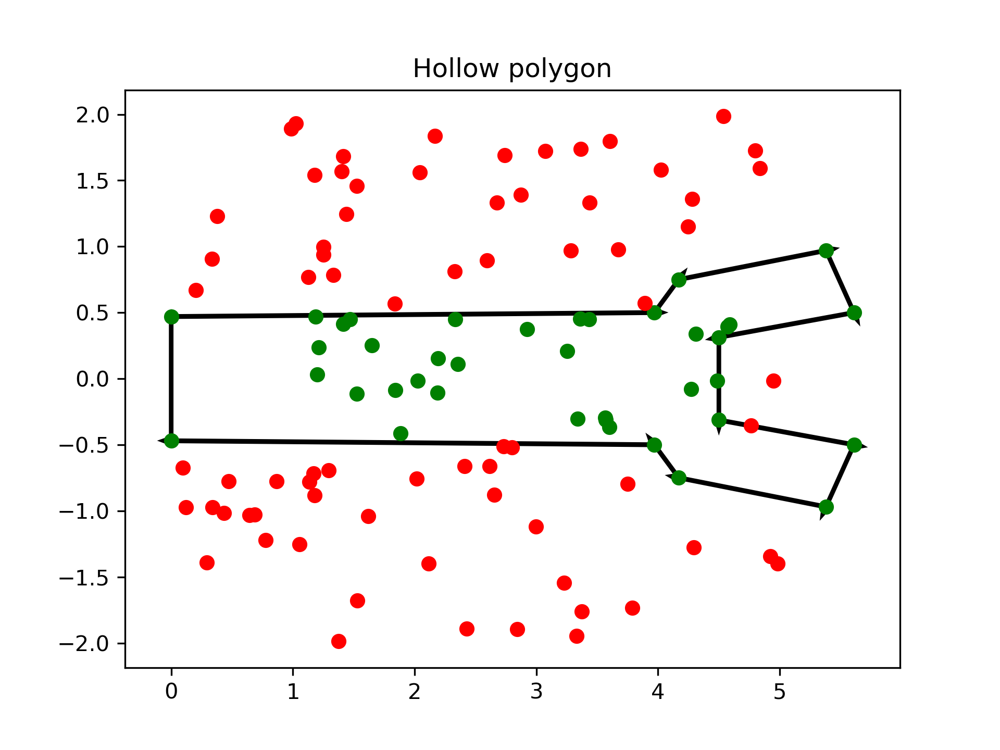
    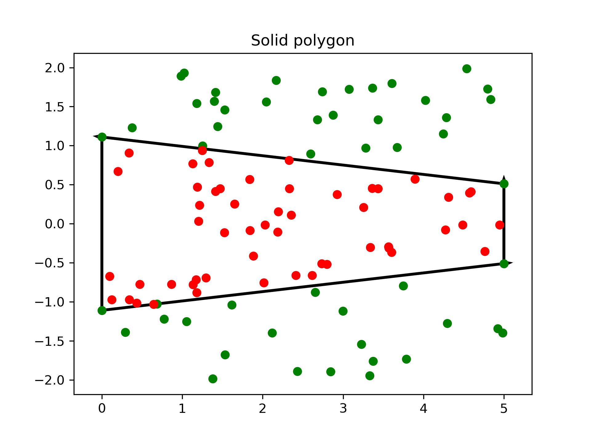
    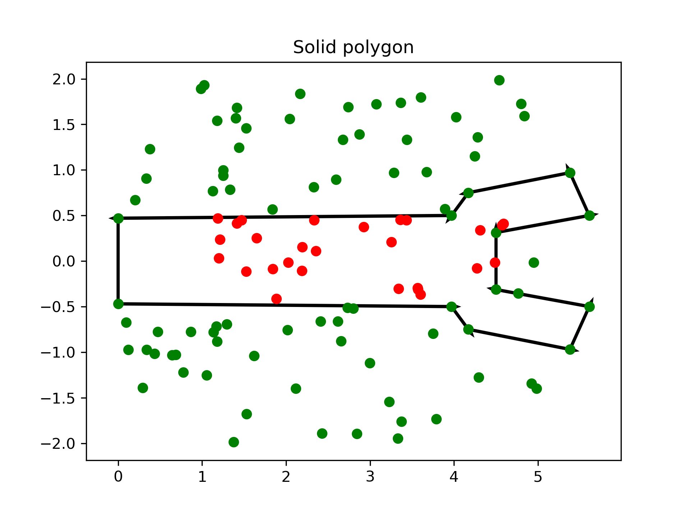

## Running

Use the `main.ipynb` Jupyter notebook to run the functions described above.
