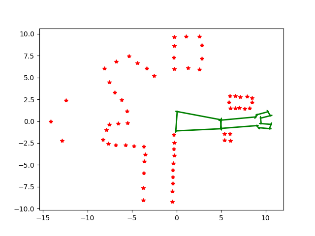
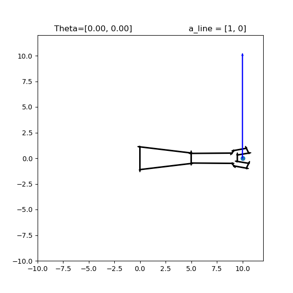
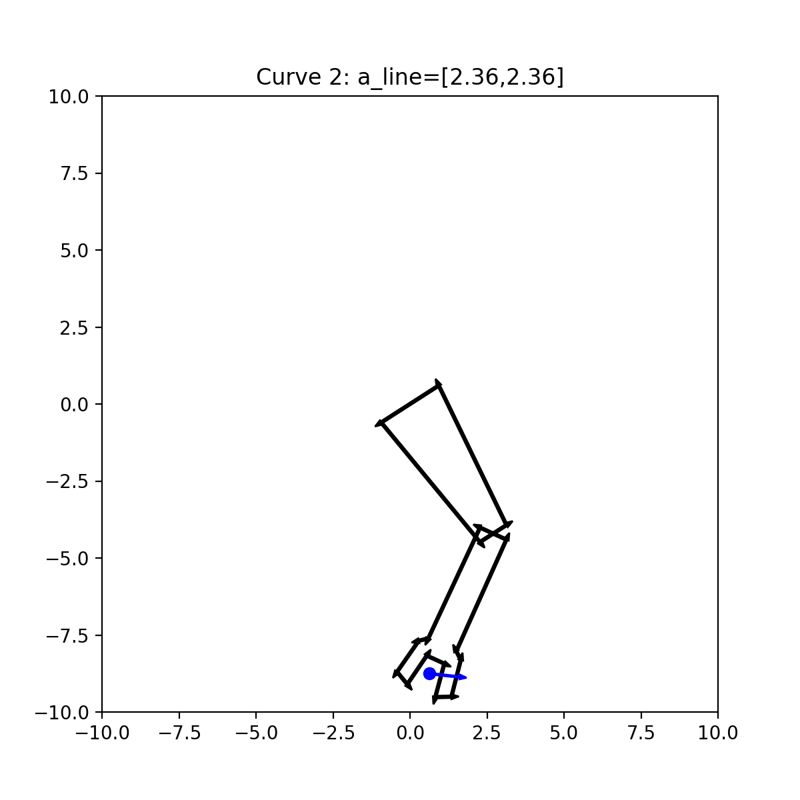
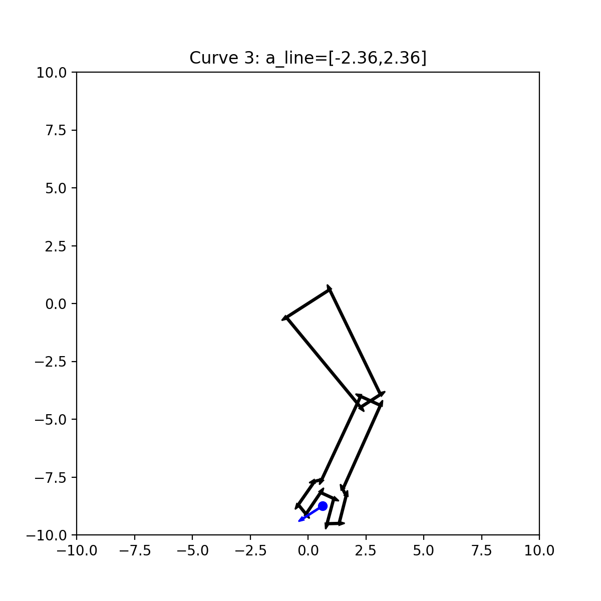
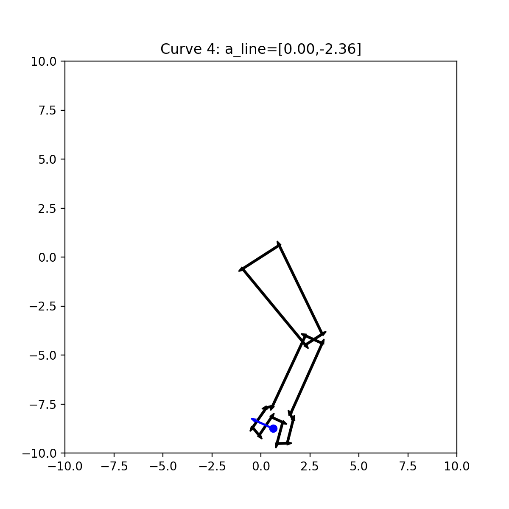

# Section 2:

## Contents

- `geometry.py`
  - Builds upon the `geometry.py` file in Section 1 to implement `Grid` and `Torus` classes.
- `robot.py`
  - Builds upon the functionality of `robot.py`in Section 1 by formally defining the `TwoLink` class, with helpers for determing end-effector position, and collision tests.
- `pygments.py`
  - Optional syntax highlighting helper script for rendering code.
- `twolink_testData.mat`
  - Test data
- `main.py`
  - Main Homework 2 implementation and test driver for geometry and queue functionality.
- `main.ipynb`
  - Jupyter notebook for running individual tests.

## `main.py` Function Call Explanations

`main.py` defines several visualization and test functions. The script entry point currently calls `torus_twolink_plot_jacobian()` when the file is run directly.

- `rotation_3d(theta, save_plot=False)`
  - For a given angle `theta`, computes the 3D rotation matrix corresponding to a rotation in the $xy$-plane.
  - Plots the original $x$-axis and the rotated vector so the effect of the transformation is easy to visualize.
    

- `plot_torus(save_plot=False)`
  - Plots the torus surface together with the four curves defined by the line parameters from the homework problem.
  - Uses `Torus.plot()` and `Torus.plot_curves()` to overlay the torus and the curve traces.
    

- `two_link_collision(theta, save_plot=False)`
  - Generates a collision-checking visualization for a two-link manipulator using obstacle points loaded from the provided test data.
  - The manipulator is drawn in green when it is clear of collision and red when it intersects an obstacle.
    

- `end_effector_velocity(save_animation=False, output_path='assets/end_effector_velocity.gif')`
  - For several two-link configurations and angular velocity vectors, plots the manipulator and an arrow showing the end-effector velocity.
  - When `save_animation=True`, it saves an animated GIF showing the sequence of configurations.
    

- `torus_twolink_plot_jacobian(animate=False, output_path='assets/torus_twolink_plot_jacobian.gif')`
  - For each of the four torus curves, computes the robot configurations along the curve and plots the two-link manipulator at each configuration.
  - Uses the Jacobian to compute the end-effector velocity direction and draws it as a blue arrow from the end-effector position.
  - When `animate=True`, it saves one GIF per curve to the `assets` folder.
    
    
    
    
