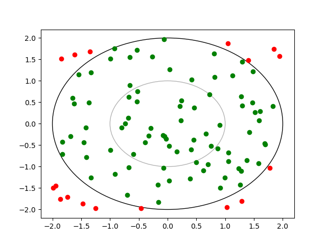
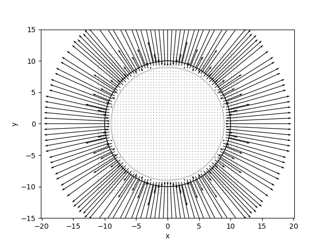
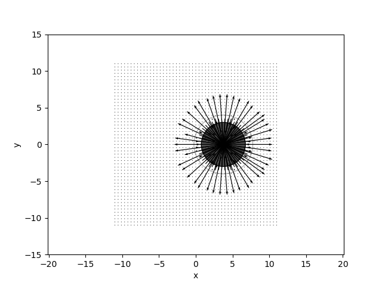
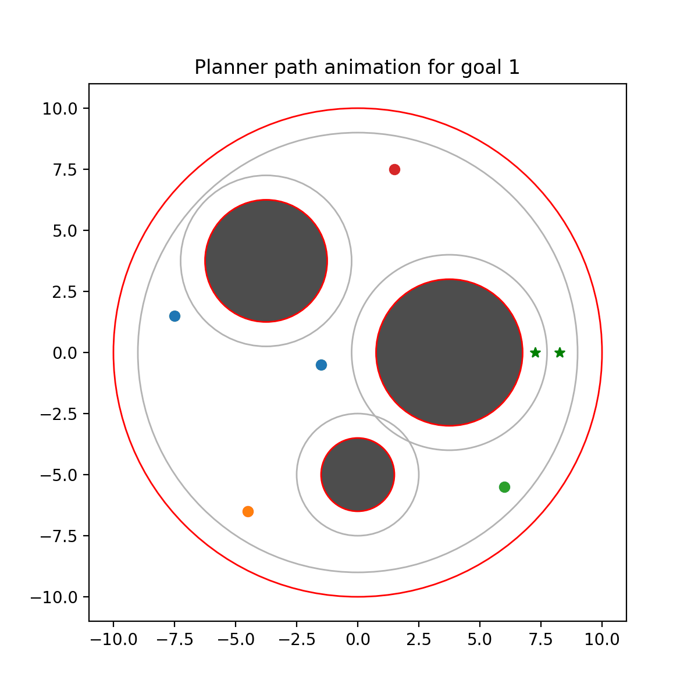
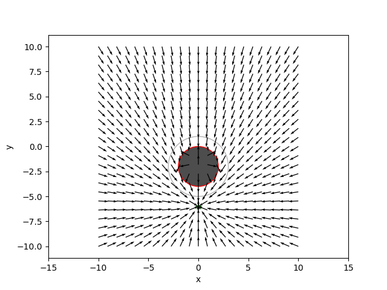
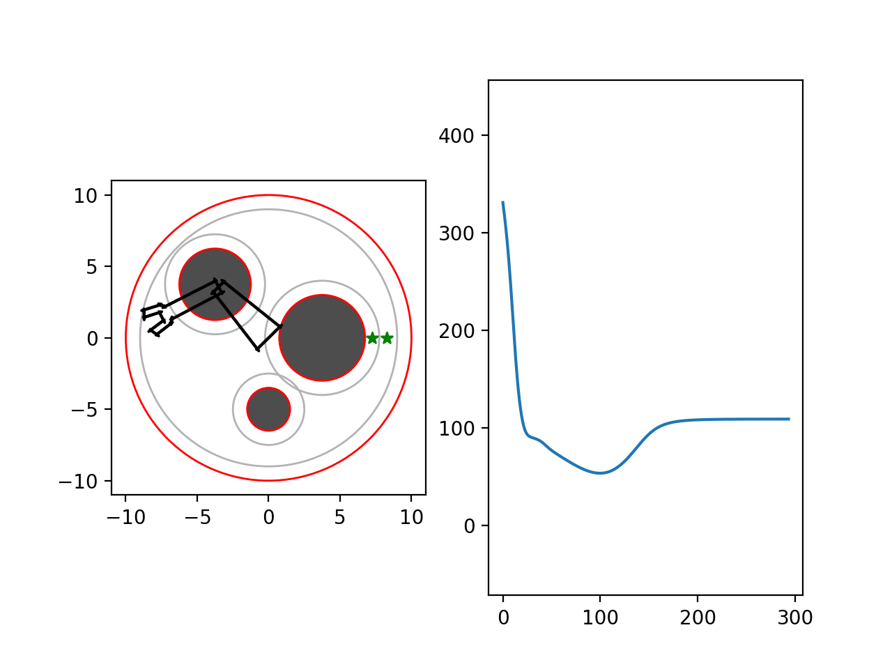
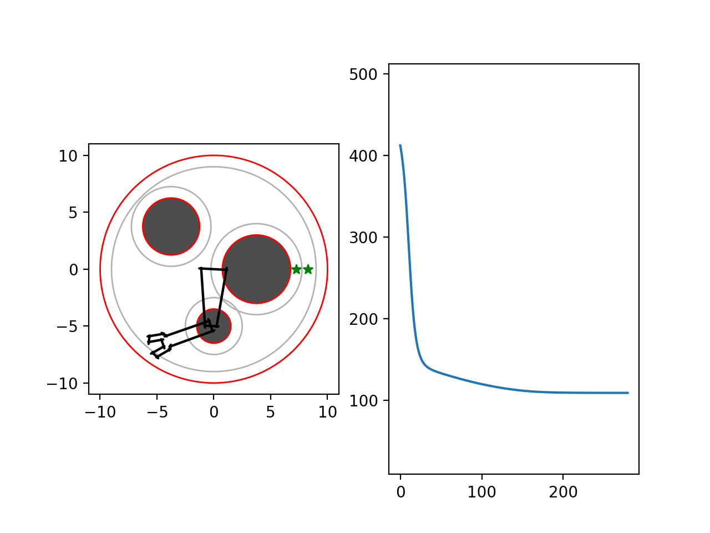
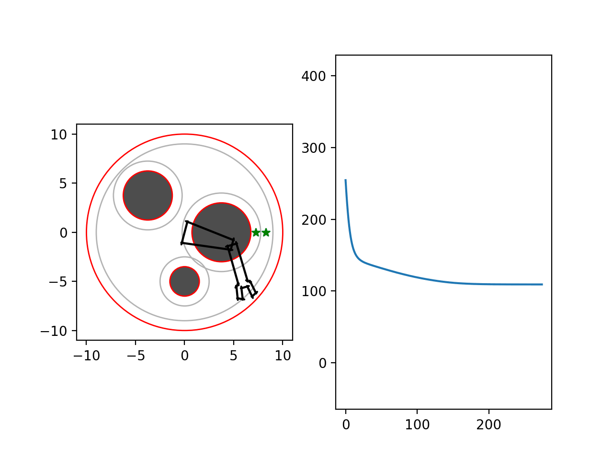
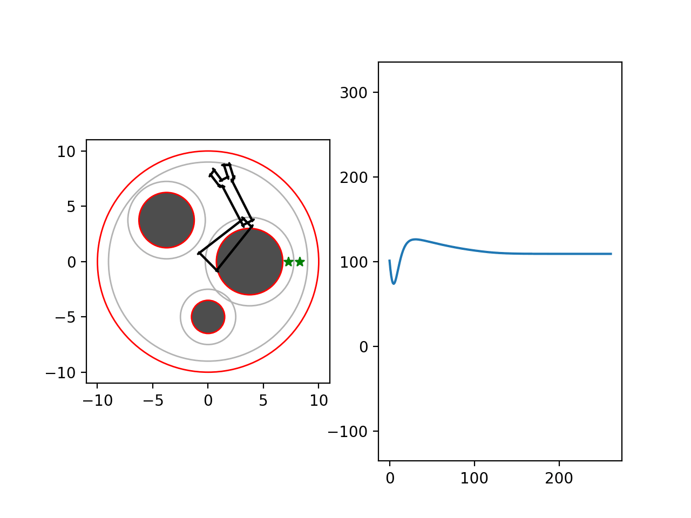
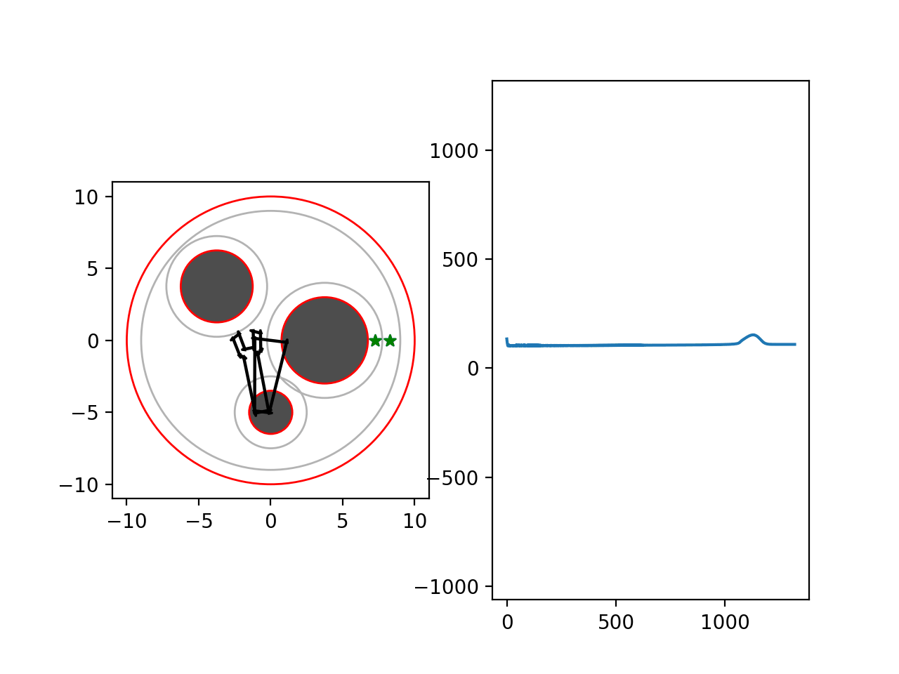

# Section 3: Potential Fields and Control-Based Planning

This section implements a sphere-world geometry, potential functions, and control-based planning. The main focus is on collision checking, repulsive and attractive potential fields, and CLF-CBF-style control field visualization.

## Contents

- `geometry.py`
  - Defines the `Sphere` and `Grid` utilities used for distance testing and field visualization.
- `potential.py`
  - Implements the potential functions, planner logic, and CLF-CBF control components.
- `qp.py`
  - Provides quadratic-programming helper utilities used by the control framework.
- `robot.py`
  - Contains the two-link robot potential-based planning extension.
- `pygments.py`
  - Optional syntax highlighting helper script for rendering code.
- `main.py`
  - Main Homework 3 implementation and test driver for the sphere-world examples.
- `main.ipynb`
  - Jupyter notebook for running the individual homework functions interactively.
- `sphereworld.mat`
  - Environment data file used by the planning examples.

## `main.py` Function Call Explanations

- `run_sphere_collision_test()`
  - Runs the sphere collision test by sampling points around a sphere and coloring them by whether they lie inside or outside the obstacle boundary.
  - The resulting plot highlights the signed distance behavior of the sphere geometry.
    

- `plot_sphere_potential_fields()`
  - Computes repulsive-field visualizations for the first two spheres in the environment.
  - These plots illustrate how the repulsive potential grows around obstacle boundaries.
    
    

- `run_planner_test()`
  - Runs the potential-based planner for the two goal locations in the sphere world.
  - Shows the planned paths and the associated potential function values over the planning horizon.
    
    

- `plot_3d_potential()`
  - Builds a 3D potential field surface over the workspace and saves the threshold-style visualization.
    

- `plot_clfcbf_control_singlesphere()`
  - Visualizes the CLF-CBF control field for a single sphere obstacle.
  - The field shows the direction of control that steers the robot while respecting the obstacle constraint.
    

- `two_link_sphere_world()`
  - Use the CLF-CBF control field to actuate the two-link manipulator
  - For the same five starting points:
    
    
    
    
    

## Running

Use the main script or the notebook workflow in this folder to run the functions described above and reproduce the figures.
