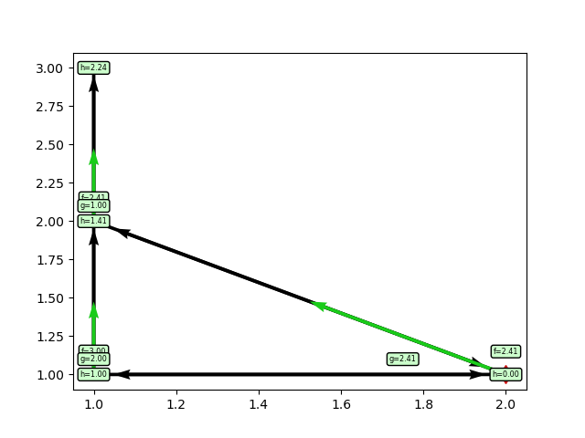
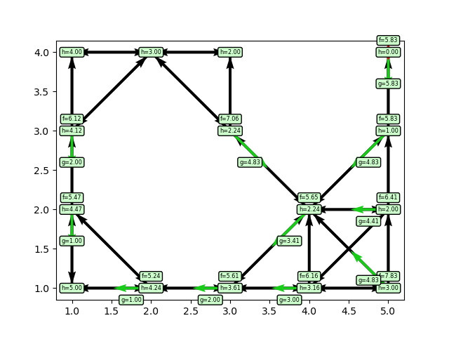
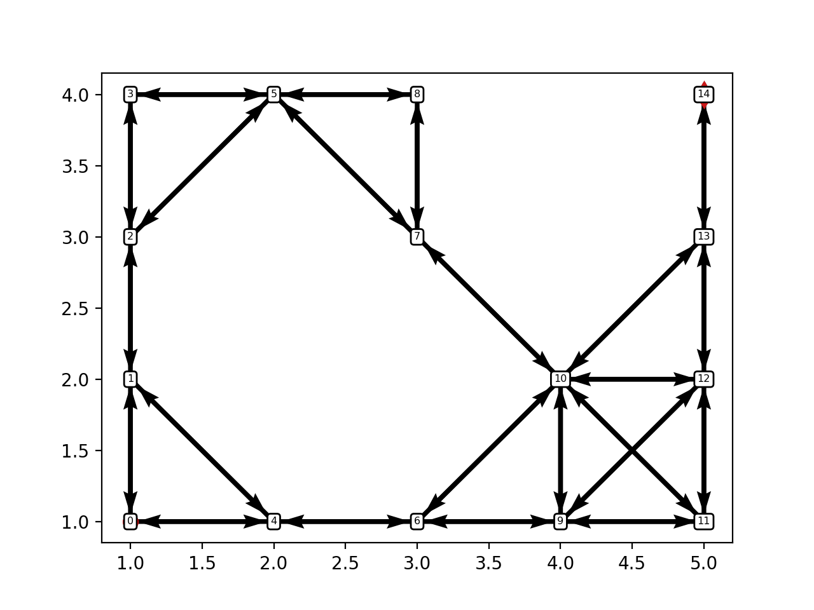
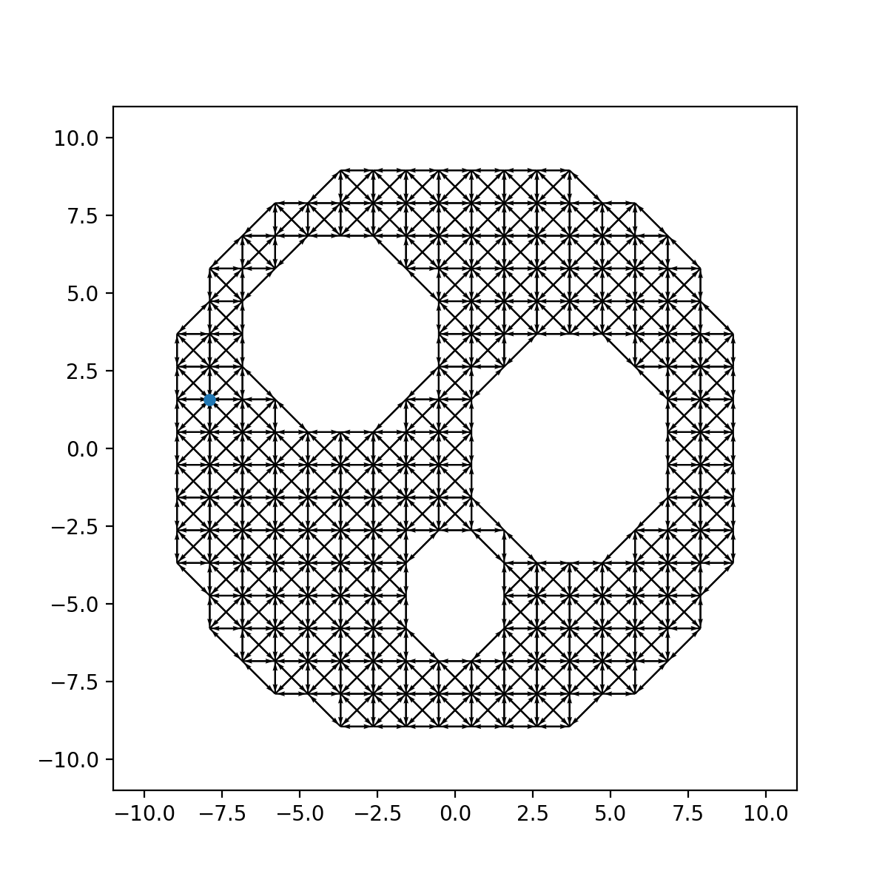
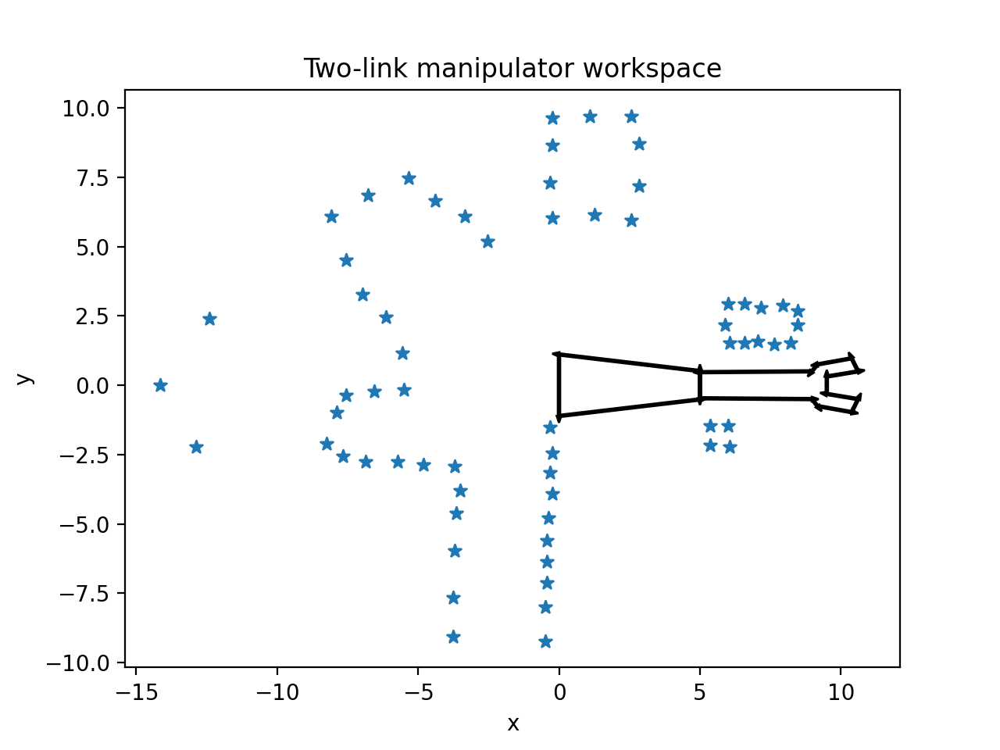
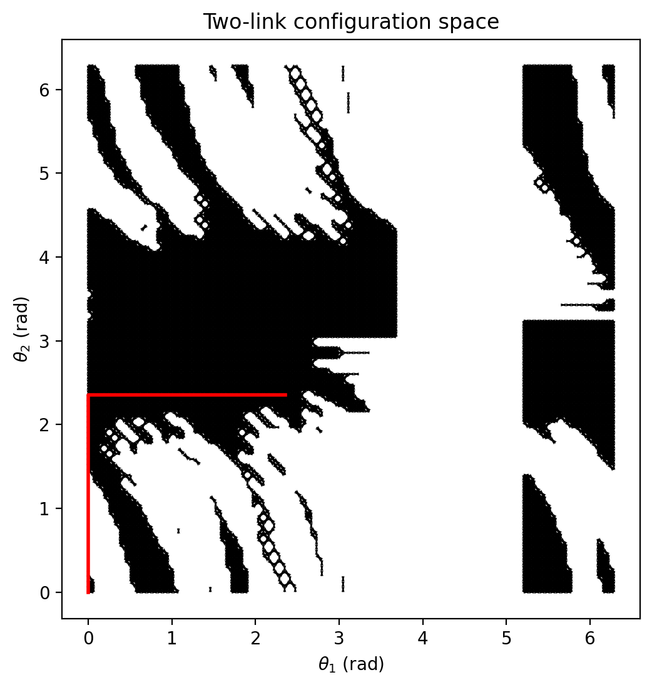
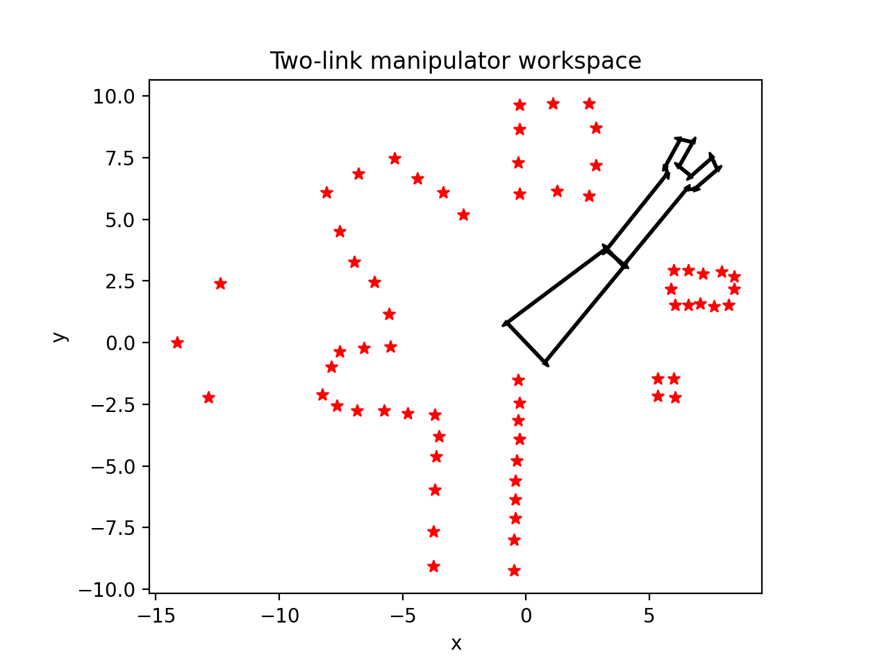
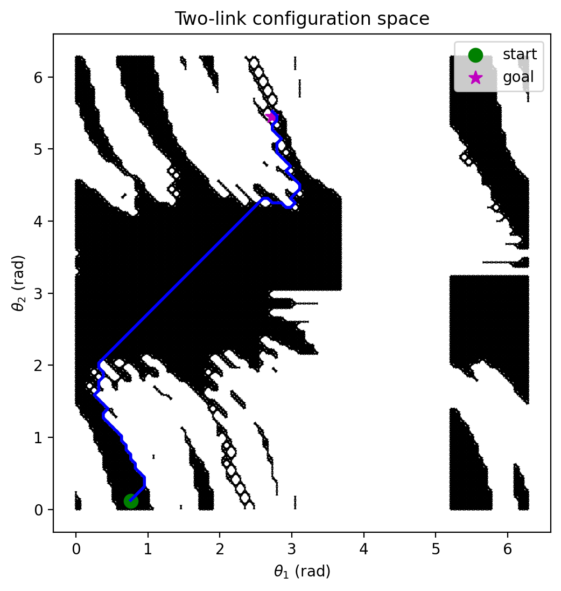

# Section 4: A\* Graph Search, Sampling, and Two-Link Planning

This section focuses on discrete graph search for planning and two-link manipulator visualization in the workspace. It includes utilities for graph construction, visualization, and several demo scripts that produce static figures and animated GIFs of planner results.

## Contents

- `geometry.py`
  - 2-D geometry utilities (rotations, Polygons, Grid) used for workspace plotting.
- `graph.py`
  - Graph data structures and search utilities used for A\*/graph-based planning.
- `robot.py`
  - Two-link manipulator kinematics, plotting, and GIF animation helpers.
- `main.py`
  - Demo scripts including `graph_search_test` and two-link planning examples.
- `assets/`
  - Generated GIFs and PNGs produced by the demo scripts (e.g., `graph_search_test.gif`).
- `twolink_freeSpace_data.mat`, `twolink_testData.mat`
  - Data files used by the two-link planners and tests.

## `main.py` Function Call Explanations

- `graph.graph_test_data_plot()`
  - Shows two graphs solved using the A\* algorithm. At each node, the green
    arrows represent the backpointers, ‘h’ is the heuristic cost (euclidean distance), ‘g’ is the
    backpointer, and ‘f’ is the total cost (h + g).
    
    

- `graph_search_test(save_img=False, outname='assets/graph_search_test.gif')`
  - Runs A\* on the provided test graph, visualizes the resulting path, and optionally animates the path incrementally.
  - When `save_img=True` the function writes an animated GIF to `assets/graph_search_test.gif` (the GIF is created with an infinite loop).
    

- `graph.test_sphereworld_graph_plot_solved(nb_cells=20)`
  - Creates a graph of SphereWorld, discretized with `nb_cells` and solves with A\* planner for multiple starting and goal locations.
    

- `twolink_test_path(theta_path)`
  - Plots a two-link configuration path both on the configuration-space graph and in the workspace.

  
  

- `two_link_search(theta_start, theta_goal)`
  - Use the A\* planner to move the manipulator from `theta_start` to `theta_goal`.
  - Calls the `TwoLink.animate` helper to create a workspace animation; the animator can accept an `axes=` argument so the manipulator is drawn on top of an existing world plot and saved as a GIF.

  

    
    
  

## Notes on Animation and README GIFs

- GIFs are produced with `imageio` and include `loop=0` so they loop indefinitely in web browsers and on GitHub.
- If a GIF appears not to loop locally, view it in a web browser (some OS viewers do not respect GIF loop metadata).

## Running

Use the main script or the notebook workflow in this folder to run the functions described above and reproduce the figures.
