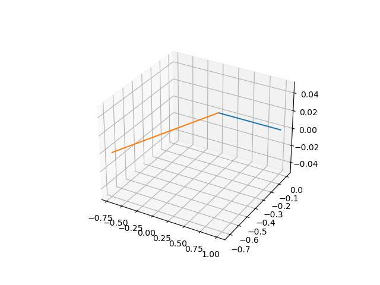
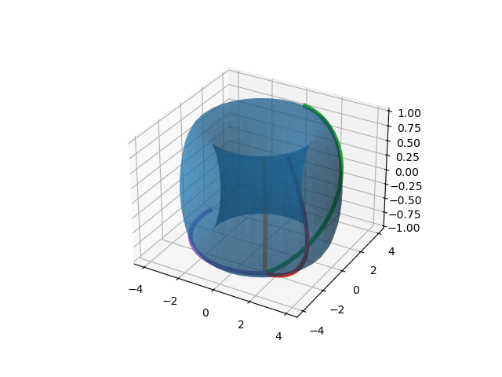
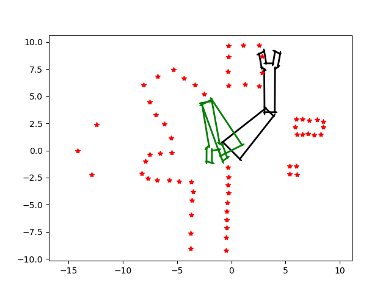

# Homework 2

This folder contains the ME570 robot motion planning Homework 2 assignment materials.

## Contents

- `geometry.py` — geometry utilities for Homework 2.
- `main.py` — main Homework 2 implementation.
- `robot.py` — robot model and motion planning code for Homework 2.
- `pygments.py` — optional syntax highlighting helper script.
- `twolink_testData.mat` — test data used by the assignment.

### Results

1. 3D rotation
   
2. Torus manifold
   
3. Two link configuration + collision test
   
