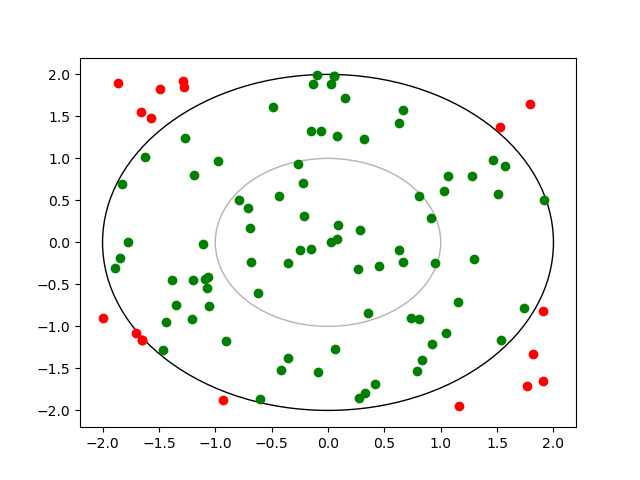
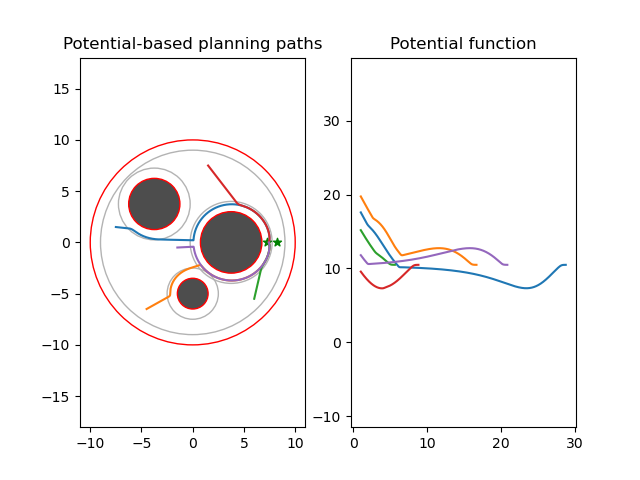
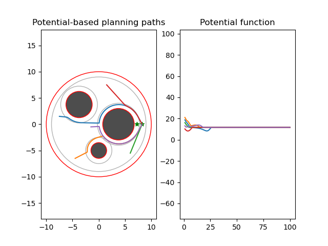
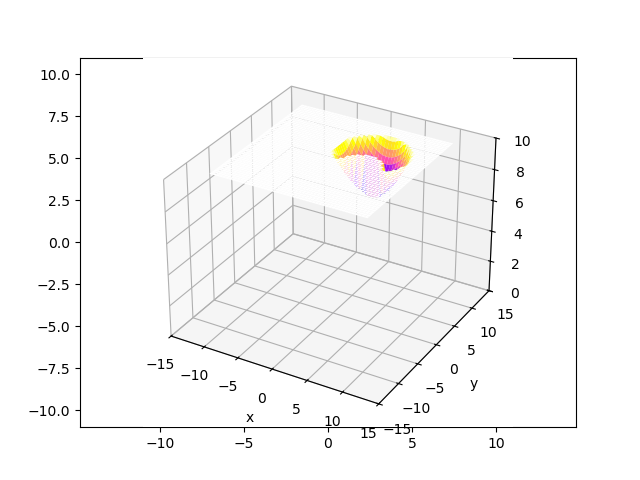
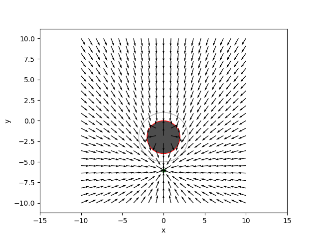

# Homework 3

This folder contains the ME570 robot motion planning Homework 3 assignment materials.

## Contents

- `geometry.py` — geometry utilities used in Homework 3.
- `main.py` — primary Homework 3 implementation.
- `potential.py` — potential field planning implementation.
- `qp.py` — quadratic programming helper utilities.
- `robot.py` — robot model and motion planning code.
- `pygments.py` — optional syntax highlighting helper script.
- `sphereworld.mat` — environment data file used by Homework 3.

1. Sphere collision test
   

2. Potential-Based Planning: 2 goal locations
   
   

   

3. CLF-CBF Control Field for Single Sphere Obstacle
   
